```{r, include=FALSE, echo=FALSE, warning=FALSE, message = FALSE}
#                      -=( Install & Load Package Function )=-
install_load <- function (package1, ...)  {   

   # convert arguments to vector
   packages <- c(package1, ...)

   # start loop to determine if each package is installed
   for(package in packages){

       # if package is installed locally, load
       if(package %in% rownames(installed.packages()))
          do.call('library', list(package))

       # if package is not installed locally, download, then load
       else {
          install.packages(package)
          do.call("library", list(package))
       }
   } 
}

install_load("MASS")

path <- function() gsub  ( "\\\\",  "/",  readClipboard ()  )
#Copy path, Panggil function di console
#Copy r path, paste ke var yang diinginkan
```

```{r setup, include=FALSE, echo=FALSE, warning=FALSE, message = FALSE}
require("knitr")
opts_knit$set(root.dir = "C:/Users/Fathan/Documents/Obsidian Vault/2. Kuliah/Smt 6/1. Metode Simulasi dan Resampling")
```

# Bab 1

## Ilustrasi

### no 1

{width="431"}

Misalkan ekor (tail) = 0 dan kepala (head) = 1.

```{r}
FlipCoin <- function(n) sample(0:1, n, rep=T) 
n <- 10
e1 <- FlipCoin(n) 
e1 
```

Terlihat isi dari sampel acak yang berjumlah 30 dan akan selalu berubah jika chunk nya di run berulang-ulang. Berikut adalah jumlah banyaknya tail dan head beserta peluangnya.

```{r}
cat("Banyaknya tail :", sum(e1==0), "dan Peluangnya :", sum(e1==0)/n,
    "\nBanyaknya head :", sum(e1==1), "dan Peluangnya :", sum(e1==1)/n)
```

Berikut adalah plot sebaran dari banyaknya hasil tail dan head pada lemparan koin.

```{r}
hist(e1,breaks=c(-0.5, 0.5, 1.5), prob=T) 
```

### no 2

{width="436"}

Misalkan Girl (perempuan) = 1 dan Boy (laki-laki) = 0.

```{r}
#Menggunakan function sebelumnya
n <- 28 
gb <- FlipCoin(n)
gb

g = 0; b=0; B=0
for(i in 1:n){
  if(gb[i] == 1){
    g <- g+1
    b <- 0
  } else{
    b <- b+1
  }
  
  if(b==4){
    B <- B+1
    b <- 0
  }
}

cat("Banyaknya anak perempuan :", g,
    "\nBanyaknya 4 anak tanpa perempuan :", B, 
    "\nPeluangnya :", g/(g+B))
```

### no 3

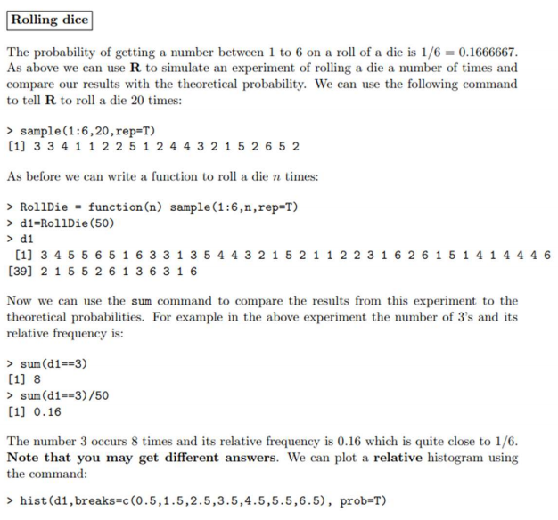{width="521"}

```{r}
RollDie <- function(n) sample(1:6, n, rep=T)
n <- 50
d1 <- RollDie(n)
d1
```

Selanjutnya akan menghitung berapa kali dadu sisi 3 muncul dan berapa frekuensi relatifnya.

```{r}
cat("Banyaknya tail :", sum(d1==3), "dan Frekuensi Relatifnya :", sum(d1==3)/n)
```

## Latihan

### no 1

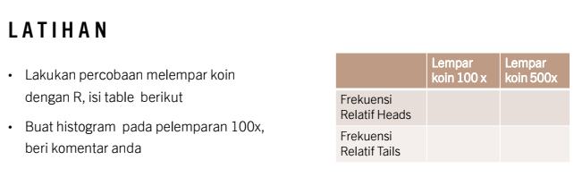{width="447"}

> Lempar koin 100 x

```{r}
n <- 100
e2 <- FlipCoin(n) 
cat("Banyaknya tail :", sum(e2==0), "dan Frekuensi Relatifnya :", sum(e2==0)/n,
    "\nBanyaknya head :", sum(e2==1), "dan Frekuensi Relatifnya :", sum(e2==1)/n)
```

Histogram

```{r}
hist(e2, breaks=c(-0.5, 0.5, 1.5), prob=T)
```

> Lempar koin 500 x

```{r}
n <- 500
e3 <- FlipCoin(n) 
cat("Banyaknya tail :", sum(e3==0), "dan Peluangnya :", sum(e3==0)/n,
    "\nBanyaknya head :", sum(e3==1), "dan Peluangnya :", sum(e3==1)/n)
```

Histogram

```{r}
hist(e3, breaks=c(-0.5, 0.5, 1.5), prob=T)
```

### no 2


```{r}
Dice <- function(n){
  d <- RollDie(n)
  rolls <- numeric(0)
  for(i in 1:6) rolls = c(rolls, sum(d==i)/n)
return(rolls)
}

RollingDice <- data.frame(
  rolls.200 = Dice(200),
  rolls.1000 = Dice(1000)
) 
rownames(RollingDice) <- paste0("RF.", 1:6)
print(RollingDice)
```

# Bab 2

```{r}
x0 <-78 
n <- 250
a <- 1598
b <- 17
m <- 1000

xi <- matrix (NA , n, 3 )
colnames (xi) <-c( "aX(i-1)+b", "Xi", "Ui") 
for  (i in 1 :n){
  xi[i,1] <- (a * x0 + b) 
  xi[i,2] <- xi[i, 1]%%m 
  xi[i,3] <- xi[i, 2]/m 
  x0 <- xi[i,2]
}
hist(xi[,3])

cbind("i"=1:20,    "Xi"=xi[1:20,2], 
      "i"=101:120, "Xi"=xi[101:120,2], 
      "i"=201:220, "Xi"=xi[201:220,2])
```

```{r}
x0 <-73 
n <- 250
a <- 17
b <- 7
m <- 1024

xi <- matrix (NA , n, 3 )
colnames (xi) <-c( "aX(i-1)+b", "Xi", "Ui") 
for  (i in 1 :n){
  xi[i,1] <- (a * x0 + b) 
  xi[i,2] <- xi[i, 1]%%m 
  xi[i,3] <- xi[i, 2]/m 
  x0 <- xi[i,2]
}
hist(xi[,3])

cbind("i"=1:20,    "Xi"=xi[1:20,2], 
      "i"=101:120, "Xi"=xi[101:120,2], 
      "i"=201:220, "Xi"=xi[201:220,2])
```

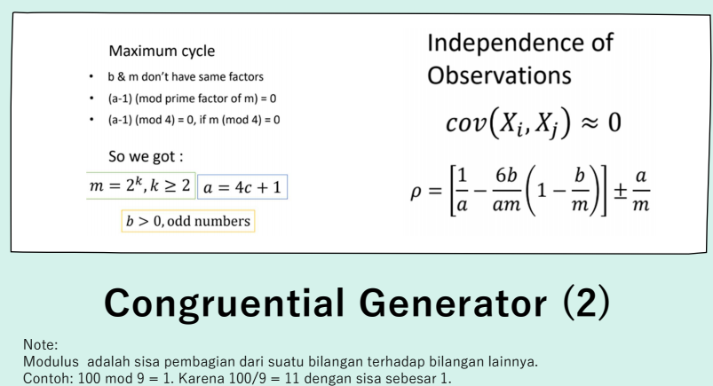

```{r}
n <- 1000
x1 <- 0.9
for(i in 2:n) x1[i] <- (pi + x1[i-1])^5%%1

hist(x1)

cbind("i"=1:20,    "Xi"=xi[1:20,2], 
      "i"=101:120, "Xi"=xi[101:120,2], 
      "i"=201:220, "Xi"=xi[201:220,2])
```

## Soal 3.5

```{r, warning=FALSE, message = FALSE}
install_load('readxl','dplyr','kableExtra','DT')
raw.data <- read_xlsx("Data pert 2.xlsx")
data <- raw.data
```

# Bab 3

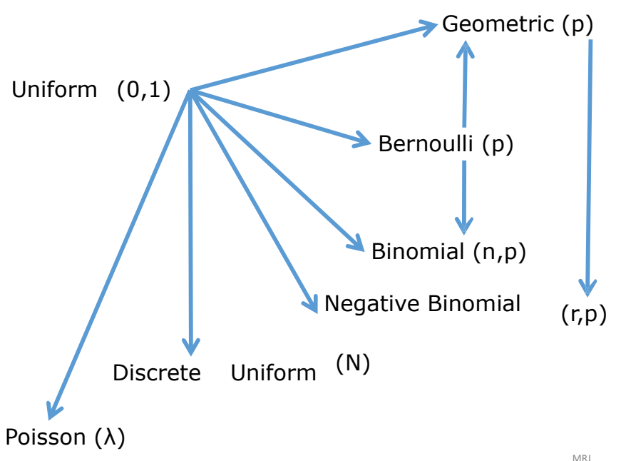{width="302"}

## Bernoulli

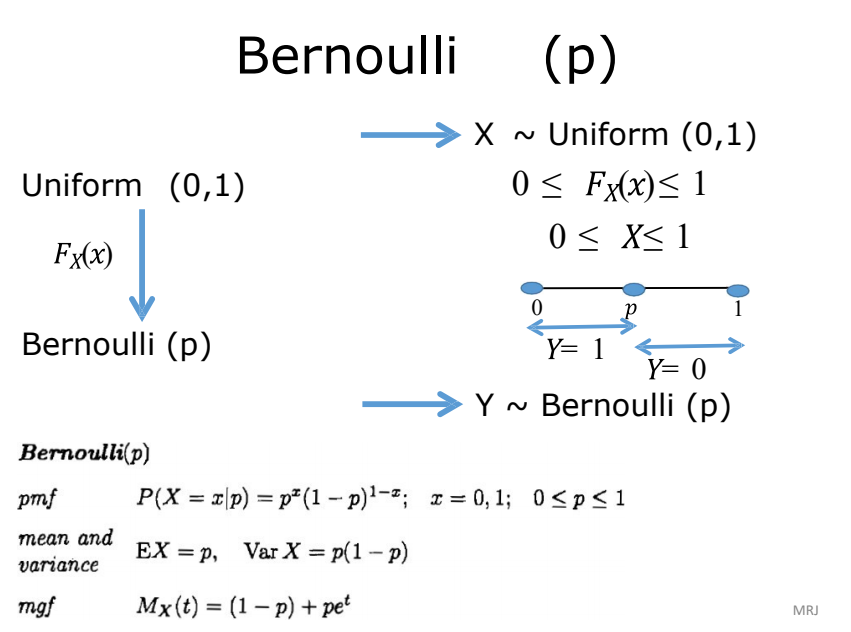{width="391"}

```{r}
i <- 1000
p <- .65
X <- runif(i)
Y <- NULL
for (z in 1:i) ifelse (X[z] <= p, Y[z] <- 1, Y[z] <- 0)
(tabel <- table(Y)/length(Y))
barplot(tabel, main="Bernoulli")

i <- 1000
p <- .65
X <- runif(i)
Y <- (X <= p)+0
(tabel <- table(Y)/length(Y))
barplot(tabel, main="Bernoulli")
```

## Seragam Diskrit

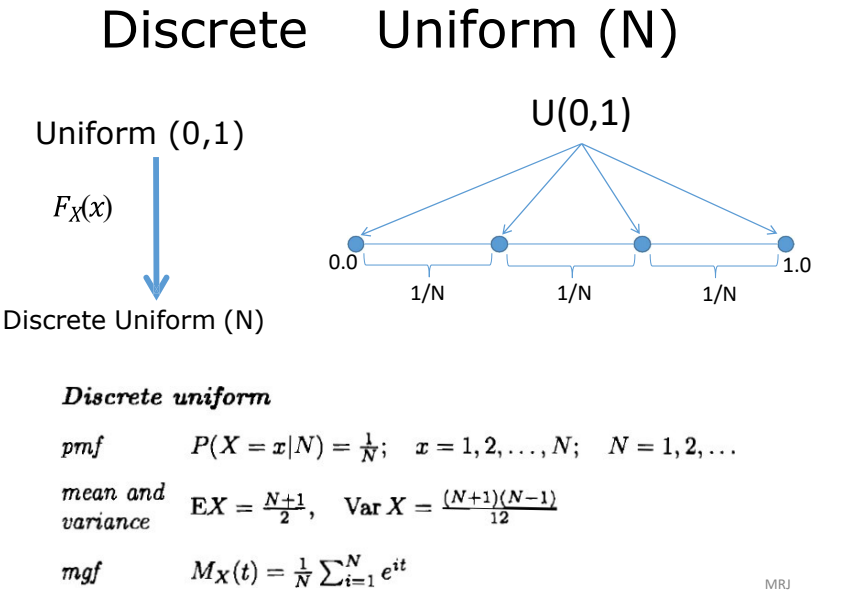{width="443"}

```{r}
i <- 1000 
N <- 4
X <- runif(i) 
DU <- NULL
for (z in 1:i){
  if (X[z]<=1/N) DU[z]<-1
    else if (X[z]<=2/N) DU[z]<-2  
    else if (X[z]<=3/N) DU[z]<-3
  else DU[z] <- 4 
}
(tabel <- table(DU)/length(DU)) 
barplot(tabel, main="Seragam Diskret")


i <- 1000 
N <- 4
X <- runif(i)
DU <- as.numeric(cut(X, breaks=c(0, 1/N, 2/N, 3/N, 1),  
include.lowest = T))
(tabel <- table(DU)/length(DU)) 
barplot(tabel, main="Seragam Diskret")
i <- 1000  
N <- 4
X <- runif(i)
DU <- 1 +floor(N*X)
(tabel <- table(DU)/length(DU))  
barplot(tabel, main="Seragam Diskret")
```

## Binomial

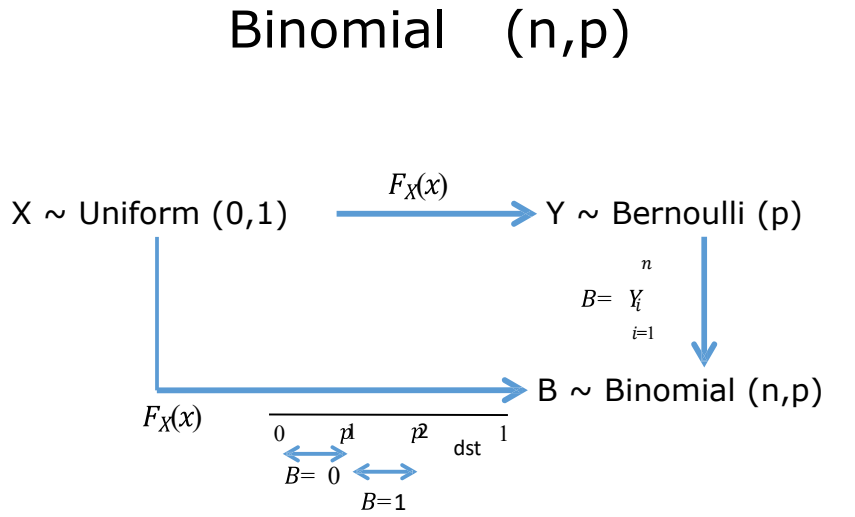{width="490"}

```{r}
#Binomial (5,0.65) 
i <- 1000
n <- 5  
p <- .65
Binom <- NULL  
for (z in 1:i){
  m <- 0
  for (k in 1:n){
    y <- (runif(1) <= p) +0  
    m <- m+y
  }
  Binom[z] <- m 
}
(tabel <- table(Binom)/length(Binom))  
barplot(tabel, main="Binomial")

#Binomial (3,0.5)  
i <- 1000
X <- runif(i)
Binom <- as.numeric(cut(X, breaks=c(0, 1/8, 4/8, 7/8, 1),  
include.lowest = T)) -1
(tabel <- table(Binom)/length(Binom)) 
barplot(tabel, main="Binomial")
```

## Geometrik

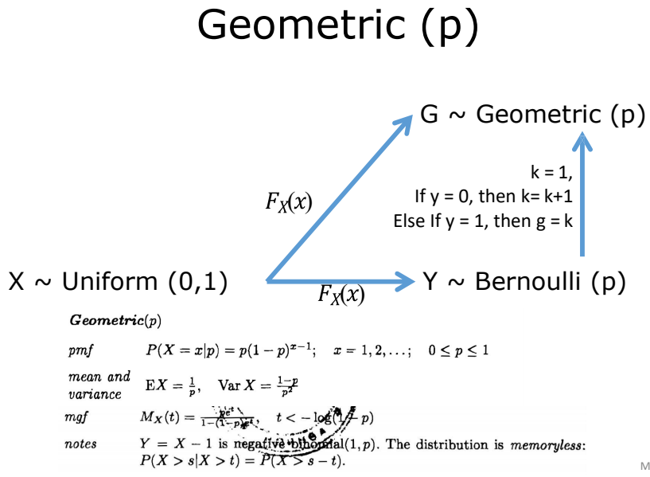{width="519"}

```{r}
set.seed(123)
geom <- rgeom(1000, prob = 0.2)

cat("Geometric Distribution (p = 0.2):\n")
head(geom)
hist(geom)
```

## Binomial Negatif

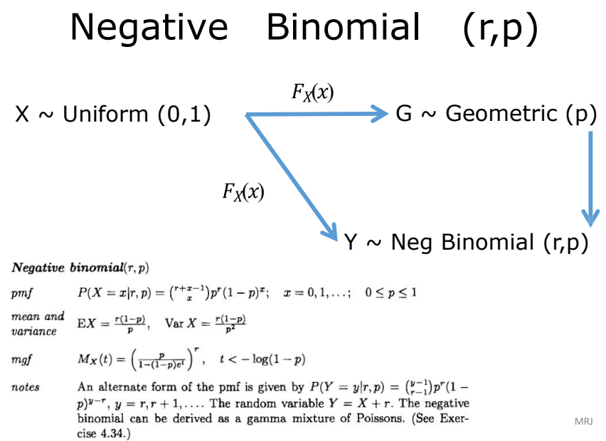{width="524"}

```{r}
nbinom <- rnbinom(1000, size = 5, prob = 0.3)

cat("\nNegative Binomial Distribution (size = 5, prob = 0.3):\n")
head(nbinom)
hist(nbinom)
```

## Inverse Transform Method

{width="336"}

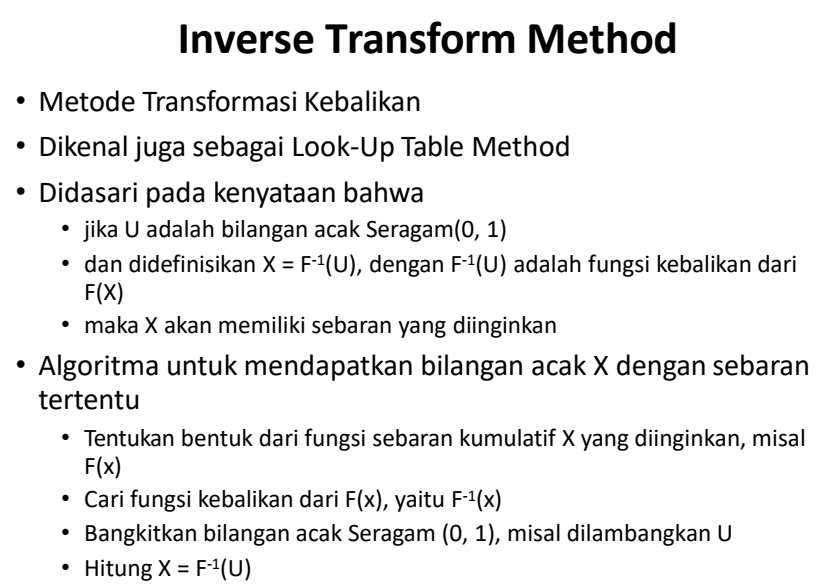{width="399"}

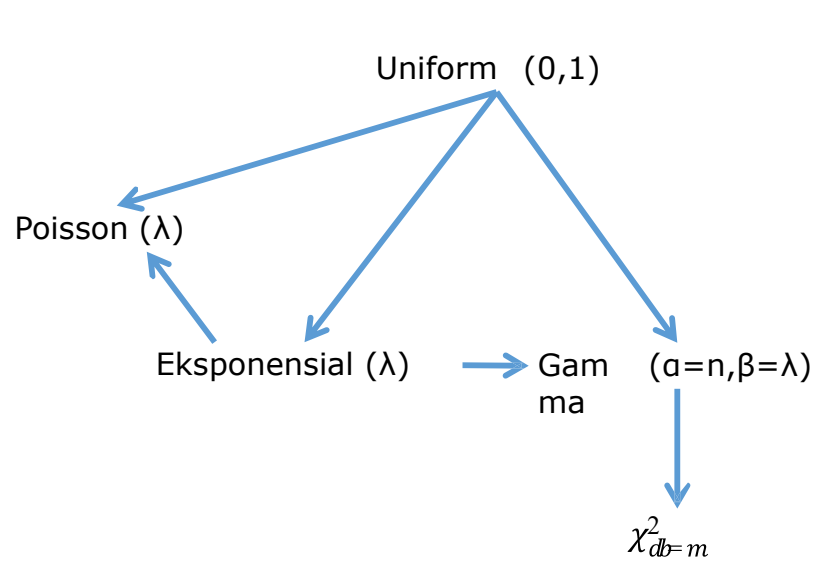{width="367"}

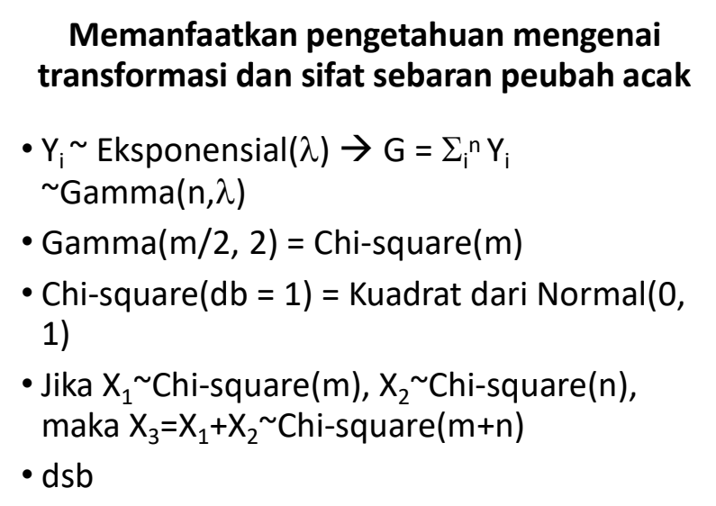{width="333"}

### Seragam

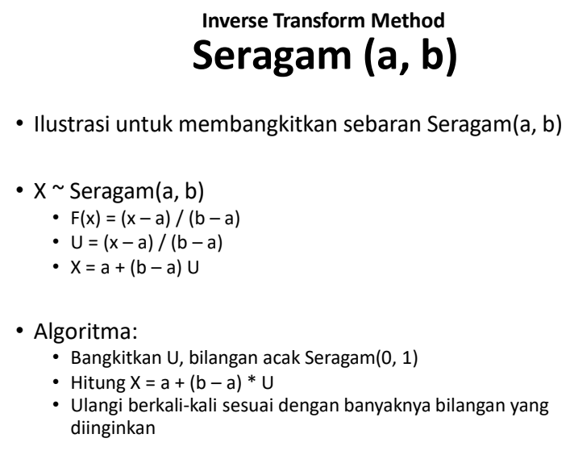{width="366"}

### Eksponensial

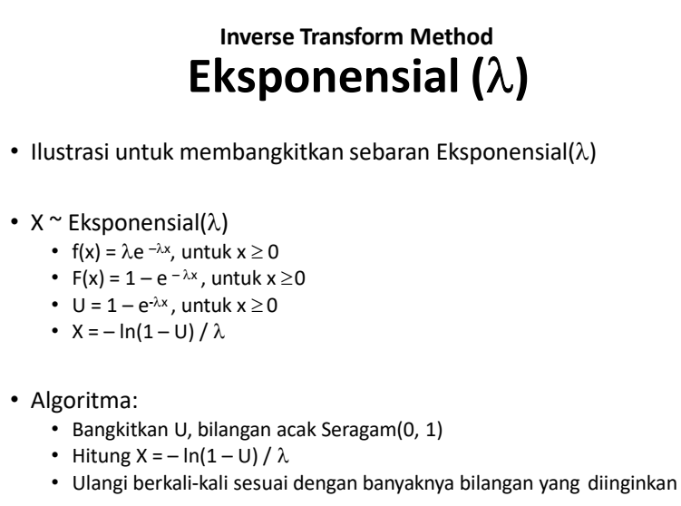{width="510"}

```{r}
i <- 1000
lambda <- 3 
U <- runif(i)
X <- -log(U)/lambda  
hist(X)
```

### Gamma

{width="442"}

```{r}
#Gamma(α=5,β=3)  
i <- 1000
lambda <- 3 
alpha <- 5
U <- log(runif(i*alpha))  
Um <- matrix(U, i)
Y <- apply(Um, 1, sum) 
Gama <- -Y/lambda  
hist(Gama)
```

### Chi-Square

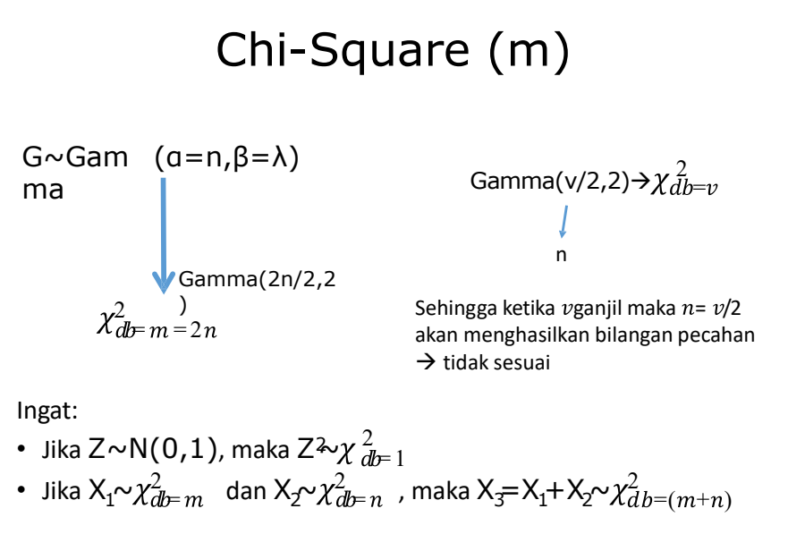{width="508"}

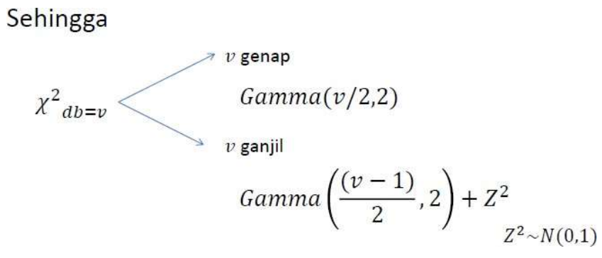{width="506"}

```{r}
#chi-square(10)  
i <- 1000
lambda <- 2 
alpha <- 5
U <- log(runif(i*alpha))  
Um <- matrix(U, i)
Y <- apply(Um, 1, sum) 
chi <- -Y/lambda  
hist(chi)

#chi-square(11)  
i <- 1000
lambda <- 2 
alpha <- 5
U <- log(runif(i*alpha))  
Um <- matrix(U, i)
Y <- apply(Um, 1, sum) 
chi <- -Y/lambda
chi <- chi +(rnorm(i))^2  
hist(chi)
```

## Poisson

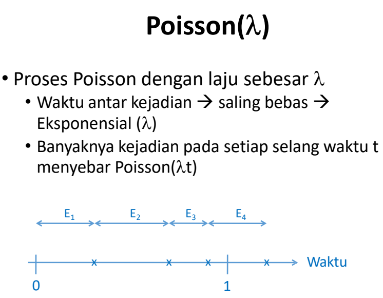{width="390"}

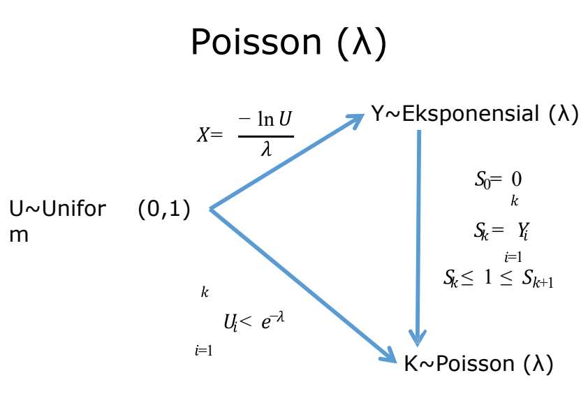{width="391"}

```{r}
#Poisson(1) melalui ekponensial  
i <- 1000
lambda <- 1  
K <- NULL
for (z in 1:i){ 
  sk <- 0  
  k <- 0
  while (sk<=1){
    u <- runif(1)
    y <- -log(u)/lambda 
    sk <- y+sk
    k <- k+1 
  }
  K[z] <- k-1 
}
(tabel <- table(K)/length(K)) 
barplot(tabel)

#Poisson(1) melalui seragam  
i <- 1000
lambda <- 1  
K <- NULL
for (z in 1:i){ 
  k <- 0
  sk <- 1
  while(sk >= exp(-lambda)){  
    u <- runif(1)
    sk <- sk*u 
    k <- k+1
  } 
  K[z] <- k
}
(tabel <- table(K)/length(K)) 
barplot(tabel)
```

## Transformasi Langsung

Terbatas, karena tidak semua sebaran bisa dihubungkan dengan sebaran lain

```{r}
#Membangkitkan Data Gamma(5,1) 
set.seed(123)
X=rgamma(100,5,scale = 1) 
head(X)
plot(density(X))
```

# Bab 5

## Praktikum

### Populasi Tak Terhingga

#### Normal

> 10 Sampel

```{r}
set.seed(15)
k<-1000 # ulangan

n<-10 #banyak sampel
x11<-matrix(rnorm(n*k),k) #bangkitkan sampel
hist(x11)
x11<-apply(x11,1,mean) #simpan rataan
hist(x11, main = "Sebaran Percontohan Normal 10 Sampel")
mean(x11); var(x11)
```

> 30 Sampel

```{r}
set.seed(15)
k<-1000 # ulangan

n<-30 #banyak sampel
x12<-matrix(rnorm(n*k),k) #bangkitkan sampel
hist(x12)

x12<-apply(x12,1,mean) #simpan rataan
hist(x12, main = "Sebaran Percontohan Normal 30 Sampel")
mean(x12); var(x12)
```

> 100 Sampel

```{r}
set.seed(15)
k<-1000 # ulangan

n<-100 #banyak sampel
x13<-matrix(rnorm(n*k),k) #bangkitkan sampel
hist(x13)
x13<-apply(x13,1,mean) #simpan rataan
hist(x13, main = "Sebaran Percontohan Normal 100 Sampel")
mean(x13); var(x13)
```

#### Eksponensial

> 10 Sampel

```{r}
set.seed(15)
k<-1000 # ulangan

n<-10 #banyak sampel
x21<-matrix(rexp(n*k),k) #bangkitkan sampel
hist(x21)

x21<-apply(x21,1,mean) #simpan rataan
hist(x21, main = "Sebaran Percontohan Eksponensial 10 Sampel")
mean(x21); var(x21)
```

> 30 Sampel

```{r}
set.seed(15)
k<-1000 # ulangan

n<-30 #banyak sampel
x22<-matrix(rexp(n*k),k) #bangkitkan sampel
hist(x22)
x22<-apply(x22,1,mean) #simpan rataan
hist(x22, main = "Sebaran Percontohan Eksponensial 30 Sampel") 
mean(x22); var(x22)
```

> 100 Sampel

```{r}
set.seed(15)
k<-1000 # ulangan

n<-100 #banyak sampel
x23<-matrix(rexp(n*k),k) #bangkitkan sampel
hist(x23)
x23<-apply(x23,1,mean) #simpan rataan
hist(x23, main = "Sebaran Percontohan Eksponensial 100 Sampel")
mean(x23); var(x23)
```

#### Seragam

> 10 Sampel

```{r}
set.seed(15)
k<-1000 # ulangan

n<-10 #banyak sampel
x31<-matrix(runif(n*k),k) #bangkitkan sampel
hist(x31)
x31<-apply(x31,1,mean) #simpan rataan
hist(x31, main = "Sebaran Percontohan Seragam 10 Sampel")
mean(x31); var(x31)
```

> 30 Sampel

```{r}
set.seed(15)
k<-1000 # ulangans

n<-30 #banyak sampel
x32<-matrix(runif(n*k),k) #bangkitkan sampel
hist(x32)
x32<-apply(x32,1,mean) #simpan rataan
hist(x32, main = "Sebaran Percontohan Seragam 30 Sampel")
mean(x32); var(x32)
```

> 100 Sampel

```{r}
set.seed(15)
k<-1000 # ulangan

n<-100 #banyak sampel
x33<-matrix(runif(n*k),k) #bangkitkan sampel
hist(x33)
x33<-apply(x33,1,mean) #simpan rataan
hist(x33, main = "Sebaran Percontohan Seragam 100 Sampel")
mean(x33); var(x33)
```

#### Perbandingan

```{r}
par(mfrow=c(3,3))
hist(x11, main = "Normal 10 Sampel",xlim = c(-2,2));hist(x12, main = "Normal 30 Sampel",xlim = c(-2,2));hist(x13, main = "Normal 100 Sampel",xlim = c(-2,2));
hist(x21, main = "Eksponensial 10 Sampel",xlim = c(0,2));hist(x22, main = "Eksponensial 30 Sampel",xlim = c(0,2));hist(x23, main = "Eksponensial 100 Sampel",xlim = c(0,2));
hist(x31, main = "Seragam 10 Sampel",xlim = c(0,1));hist(x32, main = "Seragam 30 Sampel",xlim = c(0,1));hist(x33, main = "Seragam 100 Sampel",xlim = c(0,1))
```

### Populasi Terhingga

#### Membangkitkan Populasi

```{r}
set.seed(15)
k<-1000 # ulangan

n<-10 #banyak sampel
x21<-matrix(rexp(n*k),k) #bangkitkan sampel
hist(x21)
x21<-apply(x21,1,mean) #simpan rataan
hist(x21, main = "Sebaran Percontohan Eksponensial 10 Sampel")
mean(x21); var(x21)
```

```{r}
k <- 1000
n <- 10
set.seed(14)
y1<-rexp(n*k)

set.seed(14)
coba<-matrix(rexp(n*k), k)
hist(y1)
hist(coba)
```

```{r}
y1<-rnorm(1000000)
coba<-matrix(rexp(1000000), 10000)

y2<-rexp(1000000)
y3<-runif(1000000)
hist(y1, main = "Populasi Terhingga Normal")

hist(y2, main = "Populasi Terhingga Eksponensial")

hist(y3, main = "Populasi Terhingga Uniform")
```

#### Normal

```{r}
k<-1000
n<-10
z11<-matrix(sample(y1, n*k),k)
z21<-matrix(sample(y2,n*k),k)
z31<-matrix(sample(y3,n*k),k)
z11<-apply(z11,1,mean)
z21<-apply(z21,1,mean)
z31<-apply(z31,1,mean)
hist(z11)

hist(z21)

hist(z31)
```

```{r}
meandata10 = (c(mean(z11),mean(z21),mean(z31)))
vardata10 = (c(var(z11),var(z21),var(z31)))
normal10 = data.frame("Mean" = meandata10, "Var" = vardata10, row.names = c("Normal","Eksponensial","Seragam"))
print(normal10)
```

#### Eksponensial

```{r}
k<-1000
n<-30
z12<-matrix(sample(y1,n*k),k)
z22<-matrix(sample(y2,n*k),k)
z32<-matrix(sample(y3,n*k),k)
z12<-apply(z12,1,mean)
z22<-apply(z22,1,mean)
z32<-apply(z32,1,mean)
hist(z12)

hist(z22)

hist(z32)
```

```{r}
meandata30 = (c(mean(z12),mean(z22),mean(z32)))
vardata30 = (c(var(z12),var(z22),var(z32)))
normal30 = data.frame("Mean" = meandata30, "Var" = vardata30, row.names = c("Normal","Eksponensial","Seragam"))
print(normal30)
```

#### Seragam

```{r}
k<-1000
n<-100
z13<-matrix(sample(y1,
n*k),k)
z23<-matrix(sample(y2,
n*k),k)
z33<-matrix(sample(y3,
n*k),k)
z13<-apply(z13,1,mean)
z23<-apply(z23,1,mean)
z33<-apply(z33,1,mean)
hist(z13)

hist(z23)

hist(z33)
```

```{r}
meandata100 = (c(mean(z13),mean(z23),mean(z33)))
vardata100 = (c(var(z13),var(z23),var(z33)))
normal100 = data.frame("Mean" = meandata100, "Var" = vardata100, row.names = c("Normal","Eksponensial","Seragam"))
print(normal100)
```

```{r}
par(mfrow=c(3,3))
hist(z11, main = "Normal 10 Sampel",xlim = c(-2,2));hist(z12, main = "Normal 30 Sampel",xlim = c(-2,2));hist(z13, main = "Normal 100 Sampel",xlim = c(-2,2));
hist(z21, main = "Eksponensial 10 Sampel",xlim = c(0,2));hist(z22, main = "Eksponensial 30 Sampel",xlim = c(0,2));hist(z23, main = "Eksponensial 100 Sampel",xlim = c(0,2));
hist(z31, main = "Seragam 10 Sampel",xlim = c(0,1));hist(z32, main = "Seragam 30 Sampel",xlim = c(0,1));hist(z33, main = "Seragam 100 Sampel",xlim = c(0,1))
```

## Tugas Kelompok

Lakukan simulasi seperti di atas (boleh populasi terhingga atau tak terhingga) menggunakan sebaran yang menjulur ke kiri dan n sebanyak 5, 50, dan 500! Contoh:

Bandingkan dan jelaskan perbedaan hasil histogram masing-masing sebaran normal, eksponensial, seragam, dan sebaran yang menjulur ke kiri!

> Menjulur Ke Kiri

```{r dpi=300, fig.height = 14, fig.width = 20}
k<-1000 # ulangan
n<-5 #banyak sampel
par(mfrow=c(2,3))

set.seed(15)
y21<-matrix(-rexp(n*k),k) #bangkitkan sampel
hist(y21)

n<-50 #banyak sampel
set.seed(15)
y22<-matrix(-rexp(n*k),k) #bangkitkan sampel
hist(y22)

n<-500 #banyak sampel
set.seed(15)
y23<-matrix(-rexp(n*k),k) #bangkitkan sampel
hist(y23)


yy23<-apply(y23,1,mean) #simpan rataan
hist(yy23, main = "Sebaran Percontohan Eksponensial Negatif 500 Sampel")

yy21<-apply(y21,1,mean) #simpan rataan
hist(yy21, main = "Sebaran Percontohan Eksponensial Negatif 5 Sampel")

yy22<-apply(y22,1,mean) #simpan rataan
hist(yy22, main = "Sebaran Percontohan Eksponensial Negatif 50 Sampel")
```

> Normal

```{r dpi=300, fig.height = 14, fig.width = 20}
k<-1000 # ulangan
n<-5 #banyak sampel
par(mfrow=c(2,3))

set.seed(15)
y21<-matrix(rnorm(n*k),k) #bangkitkan sampel
hist(y21)

n<-50 #banyak sampel
set.seed(15)
y22<-matrix(rnorm(n*k),k) #bangkitkan sampel
hist(y22)

n<-500 #banyak sampel
set.seed(15)
y23<-matrix(rnorm(n*k),k) #bangkitkan sampel
hist(y23)


yy23<-apply(y23,1,mean) #simpan rataan
hist(yy23, main = "Sebaran Percontohan Normal 500 Sampel")

yy21<-apply(y21,1,mean) #simpan rataan
hist(yy21, main = "Sebaran Percontohan Normal 5 Sampel")

yy22<-apply(y22,1,mean) #simpan rataan
hist(yy22, main = "Sebaran Percontohan Normal 50 Sampel")
```

> Eksponensial

```{r dpi=300, fig.height = 14, fig.width = 20}
k<-1000 # ulangan
n<-5 #banyak sampel
par(mfrow=c(2,3))

set.seed(15)
y21<-matrix(rexp(n*k),k) #bangkitkan sampel
hist(y21)

n<-50 #banyak sampel
set.seed(15)
y22<-matrix(rexp(n*k),k) #bangkitkan sampel
hist(y22)

n<-500 #banyak sampel
set.seed(15)
y23<-matrix(rexp(n*k),k) #bangkitkan sampel
hist(y23)


yy23<-apply(y23,1,mean) #simpan rataan
hist(yy23, main = "Sebaran Percontohan Eksponensial 500 Sampel")

yy21<-apply(y21,1,mean) #simpan rataan
hist(yy21, main = "Sebaran Percontohan Eksponensial 5 Sampel")

yy22<-apply(y22,1,mean) #simpan rataan
hist(yy22, main = "Sebaran Percontohan Eksponensial 50 Sampel")
```

> Seragam

```{r dpi=300, fig.height = 14, fig.width = 20}
k<-1000 # ulangan
n<-5 #banyak sampel
par(mfrow=c(2,3))

set.seed(15)
y21<-matrix(runif(n*k),k) #bangkitkan sampel
hist(y21)

n<-50 #banyak sampel
set.seed(15)
y22<-matrix(runif(n*k),k) #bangkitkan sampel
hist(y22)

n<-500 #banyak sampel
set.seed(15)
y23<-matrix(runif(n*k),k) #bangkitkan sampel
hist(y23)


yy23<-apply(y23,1,mean) #simpan rataan
hist(yy23, main = "Sebaran Percontohan Seragam 500 Sampel")

yy21<-apply(y21,1,mean) #simpan rataan
hist(yy21, main = "Sebaran Percontohan Seragam 5 Sampel")

yy22<-apply(y22,1,mean) #simpan rataan
hist(yy22, main = "Sebaran Percontohan Seragam 50 Sampel")
```

# Bab 6

## Praktikum

## Tugas Kelompok

1.  Lakukan simulasi untuk membuktikan bahwa penduga mean dan penduga varian dari sebaran seragam (uniform) merupakan penduga Tak Bias

2.  Lakukan simulasi untuk membuktikan bahwa b0 dan b1 merupakan penduga tak bias bagi $\beta_0$ dan $\beta_1$

3.  Lakukan simulai untuk selang kepercayaan 99%

### No 1. Ketakbiasan Penduga $\mu$ dan $\sigma^2$

```{r}
n = 10
k = 1000 #ulangan
set.seed(503)
populasi = runif(k, min = -2, max = 0.8) 
miu      = mean(populasi)
sigma2   = var(populasi)

sampel   = matrix(NA,k,n)
for (i in 1:k) sampel[i,] = sample (populasi,n)
xbar     = apply (sampel,1,mean)
s2       = apply(sampel,1,var)
E.xbar   = mean(xbar)
E.s2     = mean(s2)

par(mfrow=c(1,2))
hist(populasi); hist(sampel)

hasil = data.frame( "."  = c("populasi","E(sampel)"), 
                    mean   = c(miu, E.xbar), 
                    varian = c(sigma2, E.s2))
hasil
```

Dari hasil diatas nilai harapan dari $\bar{x}$ dan $s^2$ sudah mendekati atau hampir sama dengan nilai parameter $\mu$ dan $\sigma^2$ sehingga dapat dikatakan bahwa :

-   $\bar{x}$ adalah penduga tak bias bagi $\mu$

-   $s^2$ adalah penduga tak bisa bagi $\sigma^2$

### No 2. Ketakbiasan Penduga Least-Square dalam Regresi Linier

```{r}
n = 10 #ukuran contoh
k = 1000 #ulangan
beta       = c(15, 45) # beta_0 = 15 dan beta_1 = 45
sigmaerror = 3

betaduga   = matrix(NA,k,2)
for (i in 1:k){
  set.seed(503)
  
  x = runif(n)*10
  epsilon = rnorm(n,0,sqrt(sigmaerror))
  X = cbind(1,x)
  y = X %*% beta + epsilon
  betaduga[i,] = solve (t(X) %*% X) %*% (t(X) %*% y)
}

rataanbetaduga = apply(betaduga,2,mean)
names(rataanbetaduga) = c("bo","b1")
rataanbetaduga
```

Dari hasil diatas nilai harapan dari b0 dan b1 sudah mendekati atau hampir sama dengan nilai parameter $\beta_0$ dan $\beta_1$ sehingga dapat dikatakan bahwa :

b merupakan penduga tak bias bagi $\beta$

### No 3. Selang Kepercayaan

```{r}
n    = 50
k    = 100 #ulangan
alpha  = 0.005
mu   = 50
std  = 10

set.seed(503)
sampel = matrix(rnorm(n*k,mu,std),k)
xbar = apply(sampel,1,mean)
s    = apply(sampel,1,sd)
SE   = s/sqrt(n)
z    = qnorm(1-alpha/2)
SK   = (xbar-z*SE < mu & mu < xbar+z*SE)

sum(SK)/k #proporsi banyaknya SK yang memuat mu
```

```{r}
matplot(rbind (xbar-z*SE, xbar+z*SE), rbind(1:k,1:k), col=ifelse(SK,"blue","red"), type = "l", lty = 1,main='Selang Kepercayaan', xlab='SK', ylab='banyak ulangan')
abline(v=mu)
```
