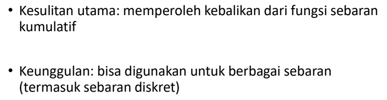
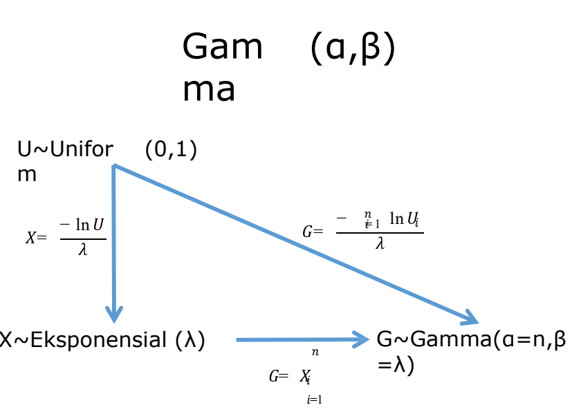

```{r, include=FALSE, echo=FALSE, warning=FALSE, message = FALSE}
#                      -=( Install & Load Package Function )=-
install_load <- function (package1, ...)  {   

   # convert arguments to vector
   packages <- c(package1, ...)

   # start loop to determine if each package is installed
   for(package in packages){

       # if package is installed locally, load
       if(package %in% rownames(installed.packages()))
          do.call('library', list(package))

       # if package is not installed locally, download, then load
       else {
          install.packages(package)
          do.call("library", list(package))
       }
   } 
}

install_load("MASS")

path <- function() gsub  ( "\\\\",  "/",  readClipboard ()  )
#Copy path, Panggil function di console
#Copy r path, paste ke var yang diinginkan
```

```{r setup, include=FALSE, echo=FALSE, warning=FALSE, message = FALSE}
require("knitr")
opts_knit$set(root.dir = "C:/Users/Fathan/Documents/Obsidian Vault/2. Kuliah/Smt 6/1. Metode Simulasi dan Resampling")
```

# Bab 1

## Ilustrasi

### no 1

{width="431"}

Misalkan ekor (tail) = 0 dan kepala (head) = 1.

```{r}
FlipCoin <- function(n) sample(0:1, n, rep=T) 
n <- 10
e1 <- FlipCoin(n) 
e1 
```

Terlihat isi dari sampel acak yang berjumlah 30 dan akan selalu berubah jika chunk nya di run berulang-ulang. Berikut adalah jumlah banyaknya tail dan head beserta peluangnya.

```{r}
cat("Banyaknya tail :", sum(e1==0), "dan Peluangnya :", sum(e1==0)/n,
    "\nBanyaknya head :", sum(e1==1), "dan Peluangnya :", sum(e1==1)/n)
```

Berikut adalah plot sebaran dari banyaknya hasil tail dan head pada lemparan koin.

```{r}
hist(e1,breaks=c(-0.5, 0.5, 1.5), prob=T) 
```

### no 2

{width="436"}

Misalkan Girl (perempuan) = 1 dan Boy (laki-laki) = 0.

```{r}
#Menggunakan function sebelumnya
n <- 28 
gb <- FlipCoin(n)
gb

g = 0; b=0; B=0
for(i in 1:n){
  if(gb[i] == 1){
    g <- g+1
    b <- 0
  } else{
    b <- b+1
  }
  
  if(b==4){
    B <- B+1
    b <- 0
  }
}

cat("Banyaknya anak perempuan :", g,
    "\nBanyaknya 4 anak tanpa perempuan :", B, 
    "\nPeluangnya :", g/(g+B))
```

### no 3

{width="521"}

```{r}
RollDie <- function(n) sample(1:6, n, rep=T)
n <- 50
d1 <- RollDie(n)
d1
```

Selanjutnya akan menghitung berapa kali dadu sisi 3 muncul dan berapa frekuensi relatifnya.

```{r}
cat("Banyaknya tail :", sum(d1==3), "dan Frekuensi Relatifnya :", sum(d1==3)/n)
```

## Latihan

### no 1

{width="447"}

> Lempar koin 100 x

```{r}
n <- 100
e2 <- FlipCoin(n) 
cat("Banyaknya tail :", sum(e2==0), "dan Frekuensi Relatifnya :", sum(e2==0)/n,
    "\nBanyaknya head :", sum(e2==1), "dan Frekuensi Relatifnya :", sum(e2==1)/n)
```

Histogram

```{r}
hist(e2, breaks=c(-0.5, 0.5, 1.5), prob=T)
```

> Lempar koin 500 x

```{r}
n <- 500
e3 <- FlipCoin(n) 
cat("Banyaknya tail :", sum(e3==0), "dan Peluangnya :", sum(e3==0)/n,
    "\nBanyaknya head :", sum(e3==1), "dan Peluangnya :", sum(e3==1)/n)
```

Histogram

```{r}
hist(e3, breaks=c(-0.5, 0.5, 1.5), prob=T)
```

### no 2


```{r}
Dice <- function(n){
  d <- RollDie(n)
  rolls <- numeric(0)
  for(i in 1:6) rolls = c(rolls, sum(d==i)/n)
return(rolls)
}

RollingDice <- data.frame(
  rolls.200 = Dice(200),
  rolls.1000 = Dice(1000)
) 
rownames(RollingDice) <- paste0("RF.", 1:6)
print(RollingDice)
```

# Bab 2

```{r}
x0 <-78 
n <- 250
a <- 1598
b <- 17
m <- 1000

xi <- matrix (NA , n, 3 )
colnames (xi) <-c( "aX(i-1)+b", "Xi", "Ui") 
for  (i in 1 :n){
  xi[i,1] <- (a * x0 + b) 
  xi[i,2] <- xi[i, 1]%%m 
  xi[i,3] <- xi[i, 2]/m 
  x0 <- xi[i,2]
}
hist(xi[,3])

cbind("i"=1:20,    "Xi"=xi[1:20,2], 
      "i"=101:120, "Xi"=xi[101:120,2], 
      "i"=201:220, "Xi"=xi[201:220,2])
```

```{r}
x0 <-73 
n <- 250
a <- 17
b <- 7
m <- 1024

xi <- matrix (NA , n, 3 )
colnames (xi) <-c( "aX(i-1)+b", "Xi", "Ui") 
for  (i in 1 :n){
  xi[i,1] <- (a * x0 + b) 
  xi[i,2] <- xi[i, 1]%%m 
  xi[i,3] <- xi[i, 2]/m 
  x0 <- xi[i,2]
}
hist(xi[,3])

cbind("i"=1:20,    "Xi"=xi[1:20,2], 
      "i"=101:120, "Xi"=xi[101:120,2], 
      "i"=201:220, "Xi"=xi[201:220,2])
```


```{r}
n <- 1000
x1 <- 0.9
for(i in 2:n) x1[i] <- (pi + x1[i-1])^5%%1

hist(x1)

cbind("i"=1:20,    "Xi"=xi[1:20,2], 
      "i"=101:120, "Xi"=xi[101:120,2], 
      "i"=201:220, "Xi"=xi[201:220,2])
```

## Soal 3.5

```{r, warning=FALSE, message = FALSE}
install_load('readxl','dplyr','kableExtra','DT')
raw.data <- read_xlsx("Data pert 2.xlsx")
data <- raw.data
```

# Bab 3

{width="302"}

## Bernoulli

{width="391"}

```{r}
i <- 1000
p <- .65
X <- runif(i)
Y <- NULL
for (z in 1:i) ifelse (X[z] <= p, Y[z] <- 1, Y[z] <- 0)
(tabel <- table(Y)/length(Y))
barplot(tabel, main="Bernoulli")

i <- 1000
p <- .65
X <- runif(i)
Y <- (X <= p)+0
(tabel <- table(Y)/length(Y))
barplot(tabel, main="Bernoulli")
```

## Seragam Diskrit

{width="443"}

```{r}
i <- 1000 
N <- 4
X <- runif(i) 
DU <- NULL
for (z in 1:i){
  if (X[z]<=1/N) DU[z]<-1
    else if (X[z]<=2/N) DU[z]<-2  
    else if (X[z]<=3/N) DU[z]<-3
  else DU[z] <- 4 
}
(tabel <- table(DU)/length(DU)) 
barplot(tabel, main="Seragam Diskret")


i <- 1000 
N <- 4
X <- runif(i)
DU <- as.numeric(cut(X, breaks=c(0, 1/N, 2/N, 3/N, 1),  
include.lowest = T))
(tabel <- table(DU)/length(DU)) 
barplot(tabel, main="Seragam Diskret")
i <- 1000  
N <- 4
X <- runif(i)
DU <- 1 +floor(N*X)
(tabel <- table(DU)/length(DU))  
barplot(tabel, main="Seragam Diskret")
```

## Binomial

{width="490"}

```{r}
#Binomial (5,0.65) 
i <- 1000
n <- 5  
p <- .65
Binom <- NULL  
for (z in 1:i){
  m <- 0
  for (k in 1:n){
    y <- (runif(1) <= p) +0  
    m <- m+y
  }
  Binom[z] <- m 
}
(tabel <- table(Binom)/length(Binom))  
barplot(tabel, main="Binomial")

#Binomial (3,0.5)  
i <- 1000
X <- runif(i)
Binom <- as.numeric(cut(X, breaks=c(0, 1/8, 4/8, 7/8, 1),  
include.lowest = T)) -1
(tabel <- table(Binom)/length(Binom)) 
barplot(tabel, main="Binomial")
```

## Geometrik

{width="519"}

```{r}
set.seed(123)
geom <- rgeom(1000, prob = 0.2)

cat("Geometric Distribution (p = 0.2):\n")
head(geom)
hist(geom)
```

## Binomial Negatif

{width="524"}

```{r}
nbinom <- rnbinom(1000, size = 5, prob = 0.3)

cat("\nNegative Binomial Distribution (size = 5, prob = 0.3):\n")
head(nbinom)
hist(nbinom)
```

## Inverse Transform Method

{width="336"}

{width="399"}

{width="367"}

{width="333"}

### Seragam

{width="366"}

### Eksponensial

{width="510"}

```{r}
i <- 1000
lambda <- 3 
U <- runif(i)
X <- -log(U)/lambda  
hist(X)
```

### Gamma

{width="442"}

```{r}
#Gamma(α=5,β=3)  
i <- 1000
lambda <- 3 
alpha <- 5
U <- log(runif(i*alpha))  
Um <- matrix(U, i)
Y <- apply(Um, 1, sum) 
Gama <- -Y/lambda  
hist(Gama)
```

### Chi-Square

{width="508"}

{width="506"}

```{r}
#chi-square(10)  
i <- 1000
lambda <- 2 
alpha <- 5
U <- log(runif(i*alpha))  
Um <- matrix(U, i)
Y <- apply(Um, 1, sum) 
chi <- -Y/lambda  
hist(chi)

#chi-square(11)  
i <- 1000
lambda <- 2 
alpha <- 5
U <- log(runif(i*alpha))  
Um <- matrix(U, i)
Y <- apply(Um, 1, sum) 
chi <- -Y/lambda
chi <- chi +(rnorm(i))^2  
hist(chi)
```

## Poisson

{width="390"}

{width="391"}

```{r}
#Poisson(1) melalui ekponensial  
i <- 1000
lambda <- 1  
K <- NULL
for (z in 1:i){ 
  sk <- 0  
  k <- 0
  while (sk<=1){
    u <- runif(1)
    y <- -log(u)/lambda 
    sk <- y+sk
    k <- k+1 
  }
  K[z] <- k-1 
}
(tabel <- table(K)/length(K)) 
barplot(tabel)

#Poisson(1) melalui seragam  
i <- 1000
lambda <- 1  
K <- NULL
for (z in 1:i){ 
  k <- 0
  sk <- 1
  while(sk >= exp(-lambda)){  
    u <- runif(1)
    sk <- sk*u 
    k <- k+1
  } 
  K[z] <- k
}
(tabel <- table(K)/length(K)) 
barplot(tabel)
```

## Praktikum

```{r}
#Membangkitkan Data Gamma(5,1) 
> set.seed(123)
> X=rgamma(100,5,scale = 1) 
> head(X)
[1] 3.389585 7.378957 1.629561 
[4] 4.778440 8.873564 5.530862 
> plot(density(X))
```
