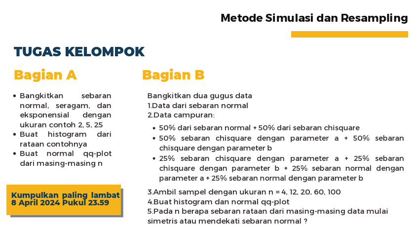

```{r setup, include=FALSE, echo=FALSE, warning=FALSE, message = FALSE}
#                      -=( Install & Load Package Function )=-
install_load <- function (package1, ...)  {   

   # convert arguments to vector
   packages <- c(package1, ...)

   # start loop to determine if each package is installed
   for(package in packages){

       # if package is installed locally, load
       if(package %in% rownames(installed.packages()))
          do.call('library', list(package))

       # if package is not installed locally, download, then load
       else {
          install.packages(package)
          do.call("library", list(package))
       }
   } 
}

install_load("fitdistrplus","ggplot2","gridExtra","cowplot")
```

> <mark style="background-color: #e9865b">**Code/Syntax :** [File.rmd](https://github.com/Zen-Rofiqy/STA1372-MRS/blob/main/Project/Kelompok%204_Praktikum_Pekan%208.Rmd) </mark>

{width="613"}

**Kelompok 4 Pararel 2**

| Nama                 | NIM         |
|----------------------|-------------|
| Angga Fathan Rofiqy  | G1401211006 |
| Gladys Adya Zafira   | G1401211014 |
| Kheni Hikmah Lestari | G1401211029 |

# Bagian A

## Poin 1 {.tabset}

> Bangkitkan sebaran **Normal**, **Seragam**, dan **Eksponensial** dengan ukuran contoh **2, 5, 25**

Berikut merupakan hasil pembangkitan masing-masing serbaran dengan ukuran contoh 2, 5, 25:

### **Normal**

```{r fig.height=3.5, fig.width=10, dpi=300}
set.seed(361)
k <- 1000 # ulangan (gak ada ketentuan berapa nya, alias bebas berapa aja)
sample_size <- c(2, 5, 25)

norm_samples <- lapply(sample_size, function(n) matrix(rnorm(n*k),k))

par(mfrow = c(1, 3))
hist(norm_samples[[1]], main = "Sebaran Normal\nUkuran sample (n=2)", 
     xlab = "Nilai", ylab = "Frekuensi", col = "#d9eacb")
hist(norm_samples[[2]], main = "Sebaran Normal\nUkuran sample (n=5)", 
     xlab = "Nilai", ylab = "Frekuensi", col = "#b4e69e")
hist(norm_samples[[3]], main = "Sebaran Normal\nUkuran sample (n=25)", 
     xlab = "Nilai", ylab = "Frekuensi", col = "#8DC16D")
```

Sebaran Normal dengan ukuran contoh (n) **2, 5, 25**

### **Seragam**

```{r fig.height=3.5, fig.width=10, dpi=300}
set.seed(361)
k <- 1000 # ulangan (gak ada ketentuan berapa nya, alias bebas berapa aja)
sample_size <- c(2, 5, 25)

unif_samples <- lapply(sample_size, function(n) matrix(runif(n*k),k))

par(mfrow = c(1, 3))
hist(unif_samples[[1]], main = "Sebaran Seragam\nUkuran sample (n=2)", 
     xlab = "Nilai", ylab = "Frekuensi", col = "#c8daf0")
hist(unif_samples[[2]], main = "Sebaran Seragam\nUkuran sample (n=5)", 
     xlab = "Nilai", ylab = "Frekuensi", col = "#a2c6eb")
hist(unif_samples[[3]], main = "Sebaran Seragam\nUkuran sample (n=25)", 
     xlab = "Nilai", ylab = "Frekuensi", col = "#4493CA")
```

Sebaran Seragam dengan ukuran contoh (n) **2, 5, 25**

### **Eksponensial**

```{r fig.height=3.5, fig.width=10, dpi=300}
set.seed(361)
k <- 1000 # ulangan (gak ada ketentuan berapa nya, alias bebas berapa aja)
sample_size <- c(2, 5, 25)

exp_samples <- lapply(sample_size, function(n) matrix(rexp(n*k),k))

par(mfrow = c(1, 3))
hist(exp_samples[[1]], main = "Sebaran Eksponensial\nUkuran sample (n=2)", 
     xlab = "Nilai", ylab = "Frekuensi", col = "#E4B3BA")
hist(exp_samples[[2]], main = "Sebaran Eksponensial\nUkuran sample (n=5)", 
     xlab = "Nilai", ylab = "Frekuensi", col = "#DE7C8A")
hist(exp_samples[[3]], main = "Sebaran Eksponensial\nUkuran sample (n=25)", 
     xlab = "Nilai", ylab = "Frekuensi", col = "#D44155")
```

Sebaran Eksponensial dengan ukuran contoh (n) **2, 5, 25**

## Poin 2

> Buat **histogram** dari **rataan contoh**nya

### **Histogram rata-rata contoh** masing-masing sebaran: {.tabset}

#### **Normal**

```{r fig.height=3.5, fig.width=10, dpi=300}
#fungsi penghitung rata-rata sebaran per ukuran sample
dist_mean <- function(n, dist_samples){
  dist_means <- list()
  for (i in seq_along(n)) 
    dist_means[[i]] <- apply(dist_samples[[i]], 1, mean)
  return(dist_means)
}

norm_means <- dist_mean(sample_size, norm_samples)

par(mfrow = c(1, 3))
hist(norm_means[[1]], main = "Sebaran Normal\nRata-rata sample (n=2)", 
     xlab = "Nilai", ylab = "Frekuensi", col = "#d9eacb")
hist(norm_means[[2]], main = "Sebaran Normal\nRata-rata sample (n=5)", 
     xlab = "Nilai", ylab = "Frekuensi", col = "#b4e69e")
hist(norm_means[[3]], main = "Sebaran Normal\nRata-rata sample (n=25)", 
     xlab = "Nilai", ylab = "Frekuensi", col = "#8DC16D")
```

#### **Seragam**

```{r fig.height=3.5, fig.width=10, dpi=300}
unif_means <- dist_mean(sample_size, unif_samples)

par(mfrow = c(1, 3))
hist(unif_means[[1]], main = "Sebaran Seragam\nRata-rata sample (n=2)", 
     xlab = "Nilai", ylab = "Frekuensi", col = "#c8daf0")
hist(unif_means[[2]], main = "Sebaran Seragam\nRata-rata sample (n=5)", 
     xlab = "Nilai", ylab = "Frekuensi", col = "#a2c6eb")
hist(unif_means[[3]], main = "Sebaran Seragam\nRata-rata sample (n=25)", 
     xlab = "Nilai", ylab = "Frekuensi", col = "#4493CA")
```

#### **Eksponensial**

```{r fig.height=3.5, fig.width=10, dpi=300}
exp_means <- dist_mean(sample_size, exp_samples)

par(mfrow = c(1, 3))
hist(exp_means[[1]], main = "Sebaran Eksponensial\nRata-rata sample (n=2)", 
     xlab = "Nilai", ylab = "Frekuensi", col = "#E4B3BA")
hist(exp_means[[2]], main = "Sebaran Eksponensial\nRata-rata sample (n=5)", 
     xlab = "Nilai", ylab = "Frekuensi", col = "#DE7C8A")
hist(exp_means[[3]], main = "Sebaran Eksponensial\nRata-rata sample (n=25)", 
     xlab = "Nilai", ylab = "Frekuensi", col = "#D44155")
```

## Poin 3 {.tabset}

> Buat **normal qq-plot** dari masing-masing n

### **Normal**

```{r fig.height=3.5, fig.width=10, dpi=300}
par(mfrow = c(1, 3))
qqnorm(norm_means[[1]], main = "QQ-Plot Normal", col = "#d9eacb", lwd = 7,
       xlab = "Theoretical Quantiles", ylab = "Sample Quantiles")
qqline(norm_means[[1]], col = "red", lwd=2)

qqnorm(norm_means[[2]], main = "QQ-Plot Normal", col = "#b4e69e", lwd = 7,
       xlab = "Theoretical Quantiles", ylab = "Sample Quantiles")
qqline(norm_means[[2]], col = "red", lwd=2)

qqnorm(norm_means[[3]], main = "QQ-Plot Normal", col = "#8DC16D", lwd = 7,
       xlab = "Theoretical Quantiles", ylab = "Sample Quantiles")
qqline(norm_means[[3]], col = "red", lwd=2)
```

### **Seragam**

```{r fig.height=3.5, fig.width=10, dpi=300}
par(mfrow = c(1, 3))
qqnorm(unif_means[[1]], main = "QQ-Plot Seragam\nUkuran Sample (n=2)", col = "#c8daf0", lwd = 7,
       xlab = "Theoretical Quantiles", ylab = "Sample Quantiles")
qqline(unif_means[[1]], col = "red", lwd=2)

qqnorm(unif_means[[2]], main = "QQ-Plot Seragam\nUkuran Sample (n=5)", col = "#a2c6eb", lwd = 7,
       xlab = "Theoretical Quantiles", ylab = "Sample Quantiles")
qqline(unif_means[[2]], col = "red", lwd=2)

qqnorm(unif_means[[3]], main = "QQ-Plot Seragam\nUkuran Sample (n=25)", col = "#4493CA", lwd = 7,
       xlab = "Theoretical Quantiles", ylab = "Sample Quantiles")
qqline(unif_means[[3]], col = "red", lwd=2)
```

### **Eksponensial**

```{r fig.height=3.5, fig.width=10, dpi=300}
par(mfrow = c(1, 3))
qqnorm(exp_means[[1]], main = "QQ-Plot Eksponensial\nUkuran Sample (n=2)", col = "#E4B3BA", lwd = 7,
       xlab = "Theoretical Quantiles", ylab = "Sample Quantiles")
qqline(exp_means[[1]], col = "red", lwd=2)

qqnorm(exp_means[[2]], main = "QQ-Plot Eksponensial\nUkuran Sample (n=5)", col = "#DE7C8A", lwd = 7,
       xlab = "Theoretical Quantiles", ylab = "Sample Quantiles")
qqline(exp_means[[2]], col = "red", lwd=2)

qqnorm(exp_means[[3]], main = "QQ-Plot Eksponensial\nUkuran Sample (n=25)", col = "#D44155", lwd = 7,
       xlab = "Theoretical Quantiles", ylab = "Sample Quantiles")
qqline(exp_means[[3]], col = "red", lwd=2)
```

## Hasil Keseluruhan

Menggunakan library `ggplot2`, `cowplot` untuk menggabungkan nya.

```{r fig.height=3.5*3, fig.width=10*3, dpi=300}
plot_distribution <- function(data_awal, data_rataan, title, color) {
  df_awal <- data.frame(x = c(data_awal))
  df_rataan <- data.frame(x = data_rataan)
  
  # Histogram sebaran awal
  p1 <- ggplot(data = df_awal, aes(x = x)) +
    geom_histogram(bins = 20, fill = color, alpha = 1) +
    geom_density(aes(y = after_stat(count)), fill = color, alpha = 0.4) +
    labs(title = paste0(title, "\nSebaran Awal")) +
    theme_minimal() +
    theme(
      plot.title = element_text(size = 10, face = "bold", hjust = 0.5)
    )
  
  # Histogram rataan sampel
  p2 <- ggplot(data = df_rataan, aes(x = x)) +
    geom_histogram(bins = 20, fill = color, alpha = 1) +
    geom_density(aes(y = after_stat(count)), fill = color, alpha = 0.4) +
    labs(title = paste0(title, "\nRata-rata Sampel")) +
    theme_minimal() +
    theme(
      plot.title = element_text(size = 10, face = "bold", hjust = 0.5)
    )
  
  # QQ plot
  p3 <- ggplot(data = df_rataan, aes(sample = x)) +
    stat_qq(color = color, size = 5) +
    stat_qq_line(color = "red", linewidth = 2) +
    labs(title = paste0(title, "\nQQ-Plot")) +
    theme_minimal() +
    theme(
      plot.title = element_text(size = 10, face = "bold", hjust = 0.5)
    )
  
  return(list(p1, p2, p3))
}

all_plots <- list()

for (size in sample_sizes) {
  plots_for_size <- list()
  
  colors <- c("#d9eacb", "#c8daf0", "#E4B3BA")
  
  plots <- plot_distribution(norm_samples[[which(sample_sizes == size)]], # Data Awal
                              norm_means[[which(sample_sizes == size)]], # Data Rataan
                              paste0("Distribusi Normal (n=", size, ")"), colors[1]) # Title & Colors
  plots_for_size <- c(plots_for_size, plots)
  
  plots <- plot_distribution(unif_samples[[which(sample_sizes == size)]], # Data Awal
                             unif_means[[which(sample_sizes == size)]], # Data Rataan
                             paste0("Distribusi Seragam (n=", size, ")"), colors[2]) # Title & Colors
  plots_for_size <- c(plots_for_size, plots)
  
  plots <- plot_distribution(exp_samples[[which(sample_sizes == size)]], # Data Awal
                             exp_means[[which(sample_sizes == size)]], # Data Rataan
                             paste0("Distribusi Eksponensial (n=", size, ")"), colors[3]) # Title & Colors
  plots_for_size <- c(plots_for_size, plots)
  
  all_plots <- c(all_plots, plots_for_size)
}

plot_grid(plotlist = all_plots, ncol = 9)
```

# Bagian B

## Poin 1 {.tabset}

> Bangkitkan **dua gugus data**

1.  Data dari sebaran **Normal**

2.  Data **campuran**:

    -   **50%** dari sebaran **normal** + **50%** dari sebaran **chi-square**

    -   **50%** sebaran **chi-square** dengan paramenter **a + 50%** sebaran chi-square dengan paramenter **b**

    -   **25%** sebaran **chi-square** dengan parameter **a** + **25%** sebaran chi-suqare dengan parameter **b** + **25%** sebaran **normal** dengan paramater **a** + **25%** sebaran **normal** parameter **b**

### **Normal**

```{r fig.height=6.5, fig.width=15, dpi=300}
set.seed(361)
norm_data <- rnorm(1000, mean = 0, sd = 1)
hist(norm_data, main = "Histogram Normal", 
     xlab = "Nilai", ylab = "Frekuensi", col = "#4664AF")
```

### **Campuran 1**

> **50%** dari sebaran **normal** + **50%** dari sebaran **chi-square**

```{r fig.height=6.5, fig.width=15, dpi=300}
set.seed(361)
csq_data <- rchisq(1000, df = 1)
mixed_data_1 <- c(norm_data[1:500], csq_data[1:500])
hist(mixed_data_1, main = "Histogram Campuran 1", 
     xlab = "Nilai", ylab = "Frekuensi", col = "#9F4274")
```

### **Campuran 2**

> **50%** sebaran **chi-square** dengan paramenter **a + 50%** sebaran chi-square dengan paramenter **b**

```{r fig.height=6.5, fig.width=15, dpi=300}
set.seed(361)
csq_data_a <- rchisq(500, df = 1)
csq_data_b <- rchisq(500, df = 2)
mixed_data_2 <- c(csq_data_a, csq_data_b)
hist(mixed_data_2, main = "Histogram Campuran 2", 
     xlab = "Nilai", ylab = "Frekuensi", col = "#66C8CC")
```

### **Campuran 3**

> **25%** sebaran **chi-square** dengan parameter **a** + **25%** sebaran chi-suqare dengan parameter **b** + **25%** sebaran **normal** dengan paramater **a** + **25%** sebaran **normal** parameter **b**

```{r fig.height=6.5, fig.width=15, dpi=300}
set.seed(361)
norm_data_a <- rnorm(250, mean = 0, sd = 1)
norm_data_b <- rnorm(250, mean = 1, sd = 1)
mixed_data_3 <- c(csq_data_a, csq_data_b, norm_data_a, norm_data_b)
hist(mixed_data_3, main = "Histogram Campuran 3", 
     xlab = "Nilai", ylab = "Frekuensi", col = "#F8D054")
```

## Poin 2

3.  Ambil **sample** dengan ukuran **n = 4, 12, 20, 60, 100**
4.  Buat **histogram** dan **normal qq-plot**
5.  Pada **n berapa** sebaran rataan dari masing-masing data **mulai simeteris** atau **mendekati** sebaran **normal**?

```{r fig.height=25, fig.width=25, dpi=300}
sample_sizes <- c(4, 12, 20, 60, 100)

plot_distribution <- function(data, title, color) {
  df <- data.frame(x = data)
  
  # Histogram
  p1 <- ggplot(data = df, aes(x = x)) +
    geom_histogram(bins = 20, fill = color, alpha = 1) +
    geom_density(aes(y = after_stat(count)), fill = color, alpha = 0.4) + 
    labs(title = paste0("\n\n",title)) +
    theme_minimal() +
    theme(
      plot.title = element_text(size = 22, face = "bold", hjust = 3)  
    )
  
  # QQ plot
  p2 <- ggplot(data = df, aes(sample = x)) +
    stat_qq(color = color, size =5) +
    stat_qq_line(color = "red", linewidth =2) +
    labs(title = paste0("\n\n\n\n")) +
    theme_minimal() 
  
  return(list(p1, p2))  
}

all_plots <- list()

for (size in sample_sizes) {
  samples <- list(
    "Mixed Data 1" = mixed_data_1,
    "Mixed Data 2" = mixed_data_2,
    "Mixed Data 3" = mixed_data_3
  )
  
  plots_for_size <- list()
  
  colors <- c("#4664AF", "#9F4274", "#66C8CC") 
  
  for (i in 1:length(samples)) {
    title <- names(samples)[i]
    sample <- sample(samples[[title]], size, replace = FALSE)
    plots <- plot_distribution(sample, paste0(title, " (n=", size,")"), colors[i])
    plots_for_size <- c(plots_for_size, plots)
  }
  
  all_plots <- c(all_plots, plots_for_size)
}

plot_grid(plotlist = all_plots, ncol = 6)
```

Dalam analisis ini, **tiga** jenis **data campuran** dieksplorasi dengan variasi ukuran sampel **(n = 4, 12, 20, 60, 100)**, menghasilkan total 15 histogram dan 15 QQ plot. Melalui observasi visual ini, ditemukan bahwa **titik di mana distribusi mulai menyerupai distribusi normal** adalah ketika <mark style="background-color: #F8D054">**ukuran sampel melebihi 20**</mark>, dengan <mark style="background-color: #e9865b">**pengecualian**</mark> pada jenis <mark style="background-color: #e9865b">**data campuran kedua**</mark>. Temuan ini secara substansial **mendukung** teori statistik yang dikenal sebagai **teorema limit pusat**. Teorema ini menyatakan bahwa, <mark style="background-color: #F8D054">*"dengan pertambahan ukuran sampel, distribusi rata-rata dari sampel yang diambil dari populasi, terlepas dari distribusi aslinya, akan cenderung mendekati distribusi normal"*. </mark> Dalam literatur statistik, penekanan sering diberikan pada ukuran sampel yang besar, umumnya **lebih dari 20**, sebagai titik di mana pendekatan ke distribusi normal menjadi semakin akurat.
