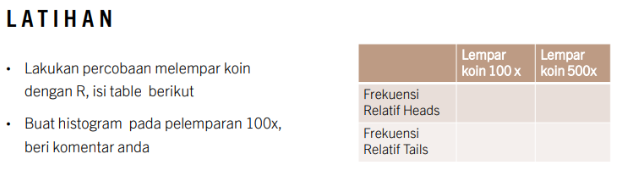

```{r setup, include=FALSE, echo=FALSE, warning=FALSE, message = FALSE}
path <- function() gsub  ( "\\\\",  "/",  readClipboard ()  )

require("knitr")
opts_knit$set(root.dir = "C:/Users/Fathan/Documents/Obsidian Vault/2. Kuliah/Smt 6/1. Metode Simulasi dan Resampling/Project")

#Export chart
export.chart <- "C:/Users/Fathan/Documents/Obsidian Vault/2. Kuliah/Smt 6/1. Metode Simulasi dan Resampling/Project/Chart"

#                      -=( Install & Load Package Function )=-
install_load <- function (package1, ...)  {   

   # convert arguments to vector
   packages <- c(package1, ...)

   # start loop to determine if each package is installed
   for(package in packages){

       # if package is installed locally, load
       if(package %in% rownames(installed.packages()))
          do.call('library', list(package))

       # if package is not installed locally, download, then load
       else {
          install.packages(package)
          do.call("library", list(package))
       }
   } 
}

install_load("DT","dplyr","ggplot2","gridExtra","readxl")
```

# Latihan 1



```{r}
# 0 = Tails, 1 = Heads 
set.seed(04052024) 
coin100 <- sample(0:1, 100, rep=T) 
table(coin100)

set.seed(04052024) 
coin500 <- sample(0:1, 500, rep=T) 
table(coin500)
hist(coin100) 
```

# Latihan 2

```{r}
x0 <- 45 
n <- 250 
a <- 1670 
b <- 23 
m <- 156 
xi <- matrix(NA,n,3) 
colnames(xi) <- c("aX(i-1)+b","Xi","Ui") 
for (i in 1:n) 
{ 
xi[i,1] <- (a*x0+b) 
xi[i,2] <- xi[i,1] %% m 
xi[i,3] <- xi[i,2]/m 
x0 <- xi[i,2] 
} 
hist(xi[,3]) 
print(xi) 
```

```{r}
x0 = 75; n = 200; a = 7; b = 3; m = 256 
xi <- matrix(NA, n, 3) 
colnames(xi) <- c("aX(i-1)+b","Xi","Ui") 
for (i in 1:n) { 
  xi[i,1] <- (a * x0 + b) 
  xi[i,2] <- xi[i,1] %% m 
  xi[i,3] <- xi[i,2] / m 
  x0 <- xi[i,2] 
} 
hist(xi[,3]) 
```

```{r}
datatable(xi)
```

```{r}
x0 = 75; n = 200; a = 7; b = 3; m = 273
xi <- matrix(NA, n, 3) 
colnames(xi) <- c("aX(i-1)+b","Xi","Ui") 
for (i in 1:n) { 
  xi[i,1] <- (a * x0 + b) 
  xi[i,2] <- xi[i,1] %% m 
  xi[i,3] <- xi[i,2] / m 
  x0 <- xi[i,2] 
} 
hist(xi[,3]) 
```

```{r}
u0 = 0.7; n = 200
for (i in 2:n){
  u0[i] <- (pi + u0[i-1])^5 %% 1
}
hist(u0) 
```
