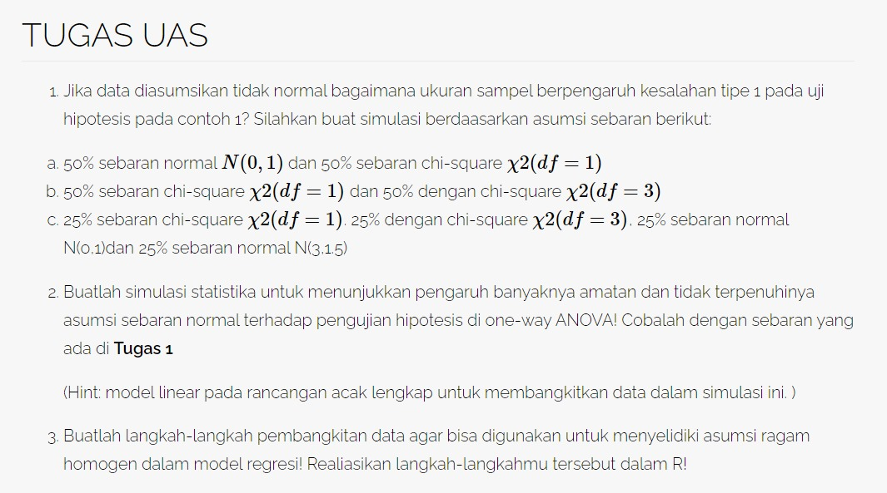

# No 1

> Jika data diasumsikan tidak normal bagaimana ukuran sampel berpengaruh kesalahan tipe 1 pada uji hipotesis pada contoh 1? Silahkan buat simulasi berdaasarkan asumsi sebaran berikut:
>
> 1.  50% sebaran normal N(0,1) dan 50% sebaran chi-square χ2(df=1)
>
> 2.  50% sebaran chi-square χ2(df=1) dan 50% dengan chi-square χ2(df=3)
>
> 3.  25% sebaran chi-square χ2(df=1). 25% dengan chi-square χ2(df=3), 25% sebaran normal N(0,1)dan 25% sebaran normal N(3,1.5)

## Sebaran {.tabset}

### Campuran 1

> 50% sebaran normal N(0,1) dan 50% sebaran chi-square χ2(df=1)

```{r fig.height=5, fig.width=15, dpi=300}
set.seed(361)
k <- 1000; n <- 1
mix_data_1 <- rbind(matrix(rnorm(n*k/2, mean = 0, sd = 1), k/2), 
                    matrix(rchisq(n *k /2, df =1), k /2))
hist(mix_data_1, main = "Sebaran Populasi Campuran 1", 
     xlab = "Nilai", ylab = "Frekuensi", col = "#792b9a")
```

### Campuran 2

> 50% sebaran chi-square χ2(df=1) dan 50% dengan chi-square χ2(df=3)

```{r fig.height=5, fig.width=15, dpi=300}
set.seed(361)
k <- 1000; n <- 1
mix_data_2 <- rbind(matrix(rchisq(n*k/2, df = 1), k/2), 
                    matrix(rchisq(n*k/2, df = 3), k/2))
hist(mix_data_2, main = "Sebaran Populasi Campuran 2", 
     xlab = "Nilai", ylab = "Frekuensi", col = "#96336c")
```

### Campuran 3

> 25% sebaran chi-square χ2(df=1). 25% dengan chi-square χ2(df=3), 25% sebaran normal N(0,1)dan 25% sebaran normal N(3,1.5)

```{r fig.height=5, fig.width=15, dpi=300}
set.seed(361)
k <- 1000; n <- 1
mix_data_3 <- rbind(matrix(rchisq(n*k/4, df = 1), k/4),
                    matrix(rchisq(n*k/4, df = 3), k/4),
                    matrix(rnorm(n*k/4, mean = 0, sd = 1), k/4),
                    matrix(rnorm(n*k/4, mean = 3, sd = 1.5), k/4) )
hist(mix_data_3, main = "Sebaran Populasi Campuran 3", 
     xlab = "Nilai", ylab = "Frekuensi", col = "#9a3b1a")
```

## Simulasi Uji Hipotesis

Hipotesis yang akan diujikan adalah sebagai berikut:

$H_0 : μ = 1500$

$H_0 : μ ≠ 1500$

Bangkitan data berdasarkan distribusi N(μ=1500,σ=200), α=0.05 dan ulangan sebanyak 10.000. Ukuran sampel yang diteliti adalah 5 sampai 50. Berilah kesimpulan atas hasilnya!

```{r}

```
